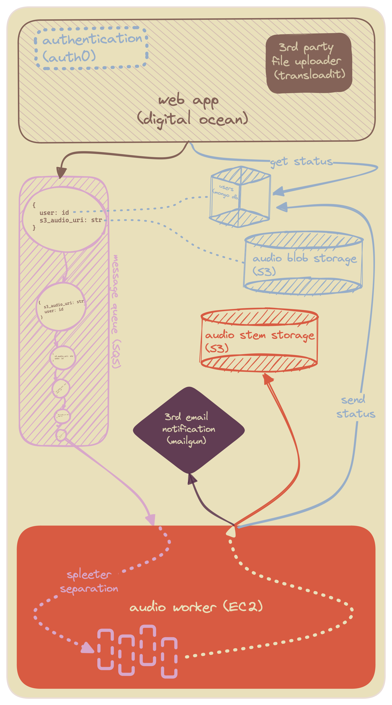

# Sound Sieve Worker
## Purpose
Free up web resources from long-running work by queue files and sending them here, where source separation is applied.

## System Design
Poll SQS for messages→Process sequentially→Upload stems to S3, send notification upon completion.

## Business Logic
1. `uri`   ⃪ pop off S3 audio file uri from SQS
1. `file`   ⃪ download `uri` to memory
1. `stem1, stem2,…, stemN`   ⃪ `spleeter.separator.Separator.separate(file)`
1. `user.uploadURI.stemsURI`   ⃪ s3.upload('stem1', 'stem2',…, 'stemN')
